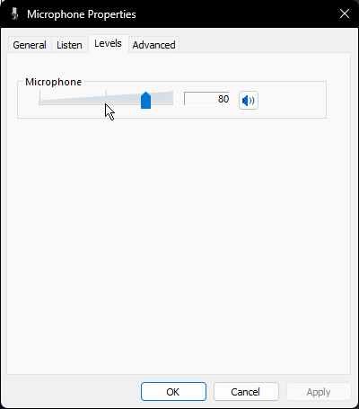
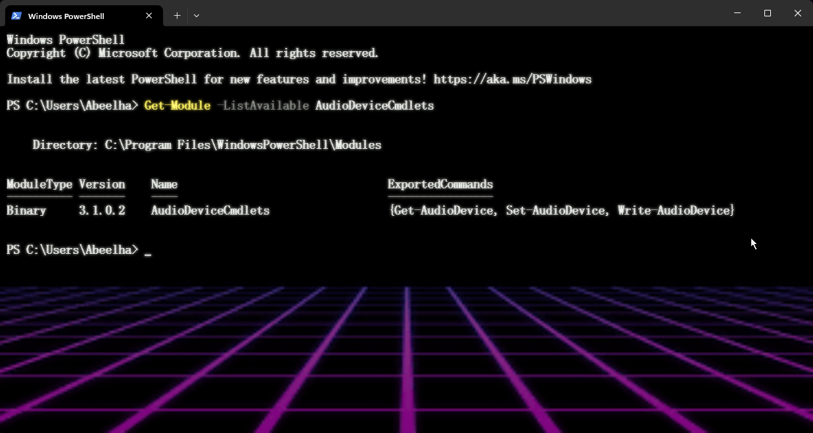
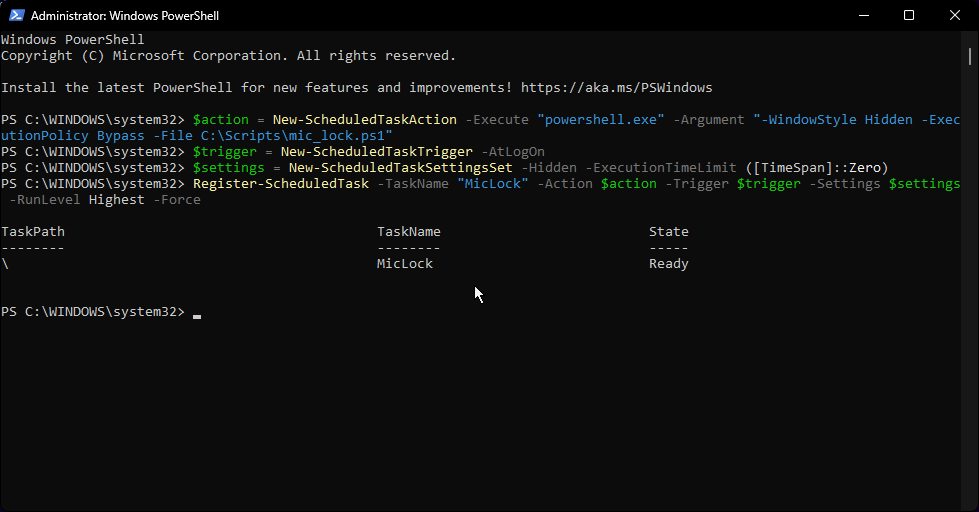
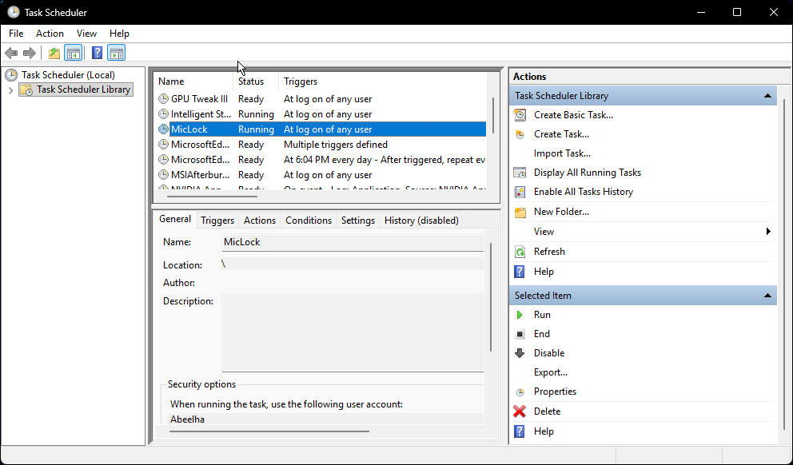
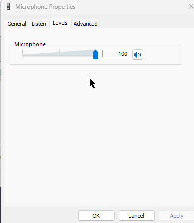

# windows-mic-lock

A lightweight PowerShell script that permanently prevents Windows, Discord, G HUB, and other apps from automatically lowering your microphone volume.

> Tested on Windows 11 with a Logitech G Pro X 2, but works for any microphone affected by auto-gain control.

---

## The Problem

Apps like Discord, Logitech G HUB, Chrome, and Windows itself constantly fight over your microphone volume — lowering it automatically through exclusive mode, AGC, or Blue VO!CE limiters.




---

## How It Works

A PowerShell script runs silently in the background via Windows Task Scheduler. Every 10 seconds it checks your default recording device volume and forces it back to 100 if anything changed it.

No bloat. No tray icon. No third-party apps running 24/7.

---

## Requirements

- Windows 10 or 11
- PowerShell 5.1+ (pre-installed on Windows)
- [AudioDeviceCmdlets](https://github.com/frgnca/AudioDeviceCmdlets) PowerShell module

---

## Installation

### Step 1 — Install the AudioDeviceCmdlets module

Open PowerShell as Administrator and run:

```powershell
Install-Module -Name AudioDeviceCmdlets -Force -Scope AllUsers
```

Verify it installed correctly:

```powershell
Get-Module -ListAvailable AudioDeviceCmdlets
```



### Step 2 — Copy the script

Create the folder and place `mic_lock.ps1` inside it:

```
C:\Scripts\mic_lock.ps1
```

You can clone this repo or manually create the file with the contents from [mic_lock.ps1](mic_lock.ps1).

### Step 3 — Register the Task Scheduler task

Run each line in PowerShell as Administrator:

```powershell
$action = New-ScheduledTaskAction -Execute "powershell.exe" -Argument "-WindowStyle Hidden -ExecutionPolicy Bypass -File C:\Scripts\mic_lock.ps1"

$trigger = New-ScheduledTaskTrigger -AtLogOn

$settings = New-ScheduledTaskSettingsSet -Hidden -ExecutionTimeLimit ([TimeSpan]::Zero)

Register-ScheduledTask -TaskName "MicLock" -Action $action -Trigger $trigger -Settings $settings -RunLevel Highest -Force
```

You should see this output confirming the task was created:



### Step 4 — Test it

1. Open **Task Scheduler**
2. Find `MicLock` in the task list
3. Right-click → **Run**
4. Lower your mic volume manually — it should snap back to 100 within 10 seconds





---

## Configuration

To change how often the script checks (default: every 10 seconds), edit `mic_lock.ps1`:

```powershell
Start-Sleep -Seconds 10  # change this value
```

Then restart the task in Task Scheduler: right-click MicLock → **End**, then → **Run**.

---

## Performance

- CPU usage: ~0% (sleeping between checks)
- RAM usage: ~15–20 MB
- No memory leaks — the loop only sleeps and sets a value

---

## Uninstall

To remove the scheduled task:

```powershell
Unregister-ScheduledTask -TaskName "MicLock" -Confirm:$false
```

Then delete `C:\Scripts\mic_lock.ps1`.

---

## Donation

If this saved your sanity, consider buying me a coffee:

```
Bitcoin  (BTC)  bc1qk5jlu7hk05uvfpt33pgeaf78lzvnkgjyur8q04
Ethereum (ETH)  0xd8834fc5330896405EC1A5db4bE997093E0408A7
USDC     (ETH)  0xd8834fc5330896405EC1A5db4bE997093E0408A7
```

---

## License

MIT
